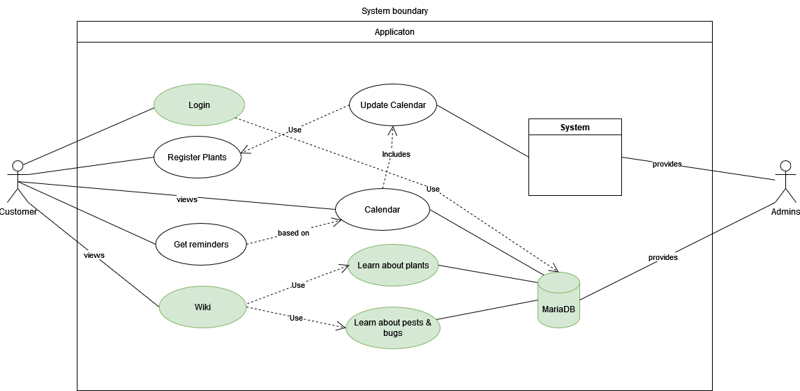

# Common Playground - Software Requirements Specification 

## Table of contents
- [Table of contents](#table-of-contents)
- [Introduction](#1-introduction)
    - [Purpose](#11-purpose)
    - [Scope](#12-scope)
    - [Definitions, Acronyms and Abbreviations](#13-definitions-acronyms-and-abbreviations)
    - [References](#14-references)
    - [Overview](#15-overview)
- [Overall Description](#2-overall-description)
    - [Vision](#21-vision)
    - [Use Case Diagram](#22-use-case-diagram)
	- [Technology Stack](#23-technology-stack)
- [Specific Requirements](#3-specific-requirements)
    - [Functionality](#31-functionality)
    - [Usability](#32-usability)
    - [Reliability](#33-reliability)
    - [Performance](#34-performance)
    - [Supportability](#35-supportability)
    - [Design Constraints](#36-design-constraints)
    - [Online User Documentation and Help System Requirements](#37-on-line-user-documentation-and-help-system-requirements)
    - [Purchased Components](#purchased-components)
    - [Interfaces](#39-interfaces)
    - [Licensing Requirements](#310-licensing-requirements)
    - [Legal, Copyright And Other Notices](#311-legal-copyright-and-other-notices)
    - [Applicable Standards](#312-applicable-standards)
- [Supporting Information](#4-supporting-information)

## 1. Introduction

### 1.1 Purpose
This Software Requirements Specification (SRS) describes all specifications for the application "Happy Plants". It includes an overview about this project and its vision, detailed information about the planned features and boundary conditions of the development process.

### 1.2 Scope
The project is going to be realized as a Website.
At first, we tried to code an Android App. You can see our old Mock-Ups here. We kept them, because the general look will stay the same.   
  
Actors of our Website can be users or moderators.  
  
Planned Subsystems are: 
* Account System:  
The login is an essential part of the application. Users can create accounts so the data can be connected to each user. Only logged in, the following functions are available to users.
* Register Plants:  
To keep track of your plants needs you can register the plants in "Happy Plants". To register a plant, information such as "name of the plant" and "size" is required. Optional data is "date of last watercycle" "last time repotted", etc.
* Reminder:  
Once you registered some plants there will be the option to be reminded on their needs, such as watering plants, repotting and fertilizing. 
* Learn about plants:  
In these functions, information is displayed in the form of articles about registered plants. These articles are about, for example, the choice of a good location.
* Learn about pests & bugs:  
In this feature you can learn more about diseases or pests. By clicking on pictures of pests, infection or plants with diseases, information in form of articles can provide helpful knowledge for care. 
* Storing Data:  
User data for accounts has to be stored. Also the registered plants have to be stored as datasets linked to the account. The data store is the basis for the account system, plant registration, reminders and articles.

### 1.3 Definitions, Acronyms and Abbreviations
| Abbrevation | Explanation                            |
| ----------- | -------------------------------------- |
| SRS         | Software Requirements Specification    |
| UC          | Use Case                               |
| n/a         | not applicable                         |
| tbd         | to be determined                       |
| UCD         | overall Use Case Diagram               |
| FAQ         | Frequently asked Questions             |

### 1.4 References

| Title                                                            |    Date    | Publishing organization |
|------------------------------------------------------------------|:----------:|-------------------------|
| [Happy Plants Blog](https://happyplants763337705.wordpress.com/) | 25.10.2022 | Happy Plants Team       |
| [GitHub](https://github.com/9991S/HappyPlants)                   | 25.10.2022 | Happy Plants Team       |

### 1.5 Overview
The following chapter provides an overview of this project with vision and Overall Use Case Diagram. The third chapter (Requirements Specification) delivers more details about the specific requirements in terms of functionality, usability and design parameters. Finally there is a chapter with supporting information. 
    
## 2. Overall Description

### 2.1 Vision
After beloved plants died despite enough water, nutrients, light and room, it was time for support. We want to develop an application that not only bundles all the information, but also keeps track of the right time to water, fertilize and repot. The goal is to have healthy and happy plants. And if the plants is still not doing well, "Happy Plants" offers quick advice to identify and fix the problem.

### 2.2 Use Case Diagram

- Update: Our Database will not be MariaDB but MySQL
- Green: Planned till end of december
- Rest: Planned till end of june

### 2.3 Technology Stack
The technology we use is:

Backend:
-SpringBoot
-MySQL 

Frontend:
-Website with HTML, Java, XML and CSS.

IDE:
-IntelliJ and VSCode

Project Management:
-YouTrack
-GitHub
-Discord

Deployment:
-Travis CI
-Docker and Heroku

Testing:
-we started to test via BDD and have some files of our first implementations.
See here for feature files with gherkin:

[Gherkin - Wiki Information Page](https://github.com/9991S/HappyPlants/blob/ad0415a0624fedbdef3d27f2ea1ec29c5f6575d5/test_driver/features/wikiInformationPage.feature)

[Gherkin - Wiki Main Activity](https://github.com/9991S/HappyPlants/blob/ad0415a0624fedbdef3d27f2ea1ec29c5f6575d5/test_driver/features/wikiMainActivity.feature)

See our step files written in dart - disclaimer: those aren't finished yet

[Step File - Wiki Information Page](https://github.com/9991S/HappyPlants/blob/b167afc03322575f47649c985afc405f8e7004e7/test_driver/steps/wikiInformationPage.dart)

[Step File - Wiki Main Aktivity](https://github.com/9991S/HappyPlants/blob/b167afc03322575f47649c985afc405f8e7004e7/test_driver/steps/wikiMainActivitySteps.dart)

## 3. Specific Requirements

### 3.1 Functionality
This section will explain the different use cases, you could see in the Use Case Diagram, and their functionality.  
Until December we plan to implement:
- 3.1.1 Creating an account
- 3.1.2 Logging in
- 3.1.3 Logging out
- 3.1.4 Register plants
- 3.1.5 Learn about plants

Until June, we want to implement:
- 3.1.6 Learn about pests & bugs
- 3.1.7 Get reminders
- 3.1.8 delete registered plants
- 3.1.9 Getting in touch with other plant owners

#### 3.1.1 Creating an account
To identify all users we need an account system. This account system enables us to build important functions such as joining a session, leaving a session or a personalized overview over all sessions (Keeping track of your sessions).

#### 3.1.2 Logging in
The app will provide the possibility to register and log in. This will also make the usability easier when a user wants to manage his sessions, post or join a session because they don't have to enter their mail address every time.

#### 3.1.3 Logging out
In case you share your Laptop, have multiple accounts or just want to be cautius about your privacy you should be able to manually log out.

#### 3.1.4 Register plants

[Register plants](Use_Case_registerPlant.md)

#### 3.1.5 Learn about plants

[Learn about plants](Use_Case_Wiki.md)

#### 3.1.6 Learn about pests and bugs

[Learn about pests and bugs](./use_cases/UC2_Join_Session.md)

#### 3.1.7 Get reminders

[Keeping track of your sessions](./use_cases/UC7_Keeping_Track.md)

#### 3.1.8 delete registered plants

[Leaving a session](./use_cases/UC8_Leave_Session.md)

#### 3.1.9 getting in touch with other plant owners

[Finding a session](./use_cases/UC9_Find_Session.md)

#### 3.1.11 Presenting yourself and checking out others
With the possibility to log in there comes another functionality, the profile. Every user will have their own profile where they can write some informations about themselves. Because of the privacy policy in Europe, the user has the possibility to only write the information they want other people to see. Using the profile, users can also check out other plant-Owner and learn from them.

#### 3.1.12 Banning users and deleting posts
There are also some functionalities for the admins. They will get the possibility to ban users and to delete any posts.

### 3.2 Usability
We plan on designing the user interface as intuitive and self-explanatory as possible to make the user feel as comfortable as possible using the website. Though an FAQ document will be available, it should not be necessary to use it.

#### 3.2.1 No training time needed
Our goal is that a user opens the application and is able to use all features without any explanation or help.

### 3.3 Reliability

#### 3.3.1 Availability
The server shall be available 95% of the time. This also means we have to figure out the "rush hours" of our app because the downtime of the server is only tolerable when as few as possible users want to use the website.

#### 3.3.2 Defect Rate
Our goal is that we have no loss of any data. 

### 3.4 Perfomance
n/a

### 3.5 Supportability

#### 3.5.1 Coding Standards
We are going to write the code by using all of the most common clean code standards. For example we will name our variables and methods by their functionalities. This will keep the code easy to read by everyone and make further developement much easier.

#### 3.5.2 Testing Strategy
The application will have a high test coverage and all important functionalities and edge cases should be tested. Further mistakes in the implementation will be discovered instantly and it will be easy to locate the error. 

### 3.6 Design Constraints
We are trying to provide a modern and easy to handle design for the UI aswell as for the architecture of our application. To achieve that the functionalities will be kept as modular as possible.

Because we are progamming a Website we chose JavaScript as our programming language. Also we are using the common MVC-architecture to keep the front end and back end seperated. 

### 3.7 On-line User Documentation and Help System Requirements
The usage of the website should be as intuitive as possible so it won't need any further documentation. If the user needs some help we will implement a "Help"-Button on the website which includes a FAQ and a formular to contact the developement team.

### 3.8 Purchased Components
We don't have any purchased components yet. If there will be purchased components in the future we will list them here.

### 3.9 Interfaces

#### 3.9.1 User Interfaces
The User interfaces that will be implented are:
- Register - provides a registration form
- Login - this page is used to log in
- Dashboard - lists all registered plants and makes it possible to get to the other features.
- Reminder - A List of all current and oncoming reminders
- Learn about plants - Shows articles
- Learn about bugs - shows pictures 
- Settings - shows the settings

#### 3.9.2 Hardware Interfaces
n/a

#### 3.9.3 Software Interfaces
n/a

#### 3.9.4 Communication Interfaces
The server and hardware will communicate using the http protocol. 

### 3.10 Licensing Requirements

### 3.11 Legal, Copyright, and Other Notices
The logo we will create is going to be licensed to the Happy Plants Team and is only allowed to use for the application. We do not take responsibilty for any incorrect data or errors in the application.

### 3.12 Applicable Standards
The development will follow the common clean code standards and naming conventions. Also we will create a definition of d which will be added here as soon as its complete.

## 4. Supporting Information
For any further information you can contact the Happy Plant Team or check our [Happy Plants Blog](https://happyplants763337705.wordpress.com/). 
The Team Members are:
- Erika
- Julien
- Heiko
- Nikolas
- Emili

<!-- Picture-Link definitions: -->
[OUCD]: https://github.com/9991S/HappyPlants/blob/master/Software%20Requirements%20Specification_files/Untitled%20Diagram.drawio "Overall Use Case Diagram"
