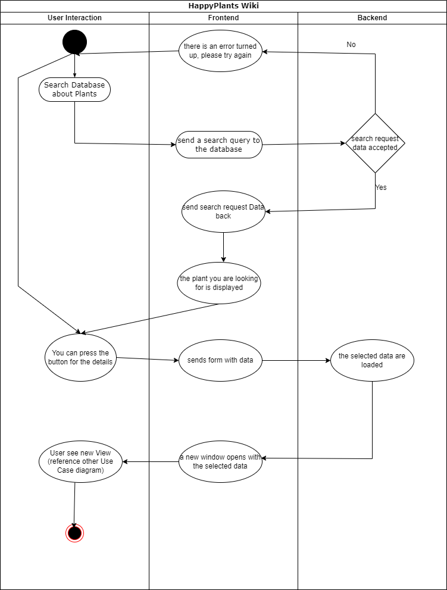
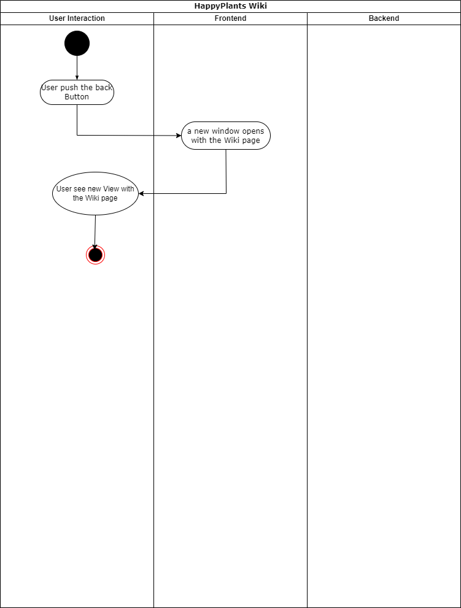
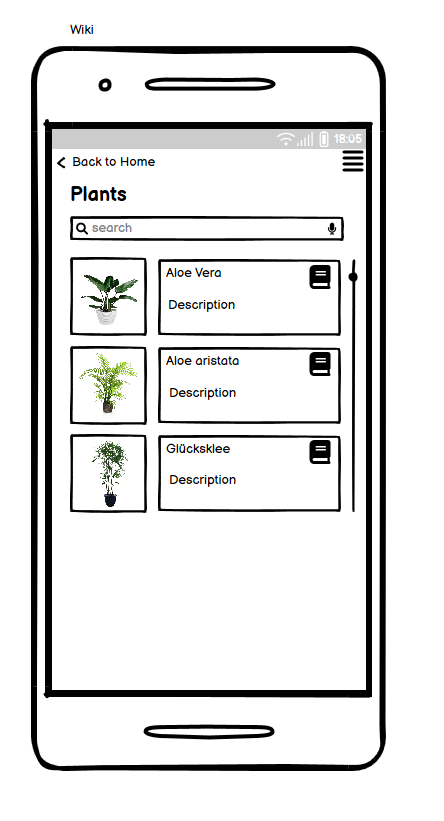
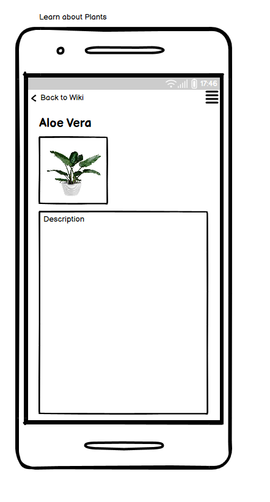

# 1 Use-Case Wiki
Use Case: "Learn about plants"

## 1.1 Brief Description
In "Learn about plants" you can search for a specific plant name. You can then click on the "more details" to open a new window. 
This View contains a picture of the selected plant and the information about it. Here we also have a button to return to the Wiki-search-page.

# 2 Flow of Events
## 2.1 Basic Flow
- User clicks on "create operation" button
- User fills in the form
- User clicks on "create" to create the operation, he will be sent to the details view of the operation. A success message will be shown.
- User clicks on "cancel" to close the form without saving the operation.

### 2.1.1 Activity Diagram

### 2.1.2 Mock-up

### 2.1.3 Narrative

## 2.2 Alternative Flows
(n/a)

# 3 Special Requirements
(n/a)

# 4 Preconditions
## 4.1 Login
The user has to be logged in to the system.

# 5 Postconditions
(n/a)
 
# 6 Extension Points
(n/a)
