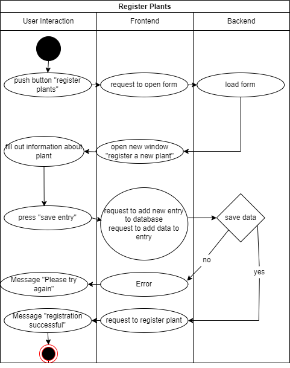

# 1 Use-Case Register Plants
Use Case: "how to register a plant"

## 1.1 Brief Description
In "Register plants" you can register a new plant. Therefore you add a new entry in the database and fill out all the information.

# 2 Flow of Events
## 2.1 Basic Flow
- User clicks on "create operation" button
- User fills in the the form
- User clicks on "create" to create the operation, he will be sent to the details view of the operation. A success message will be shown.
- User clicks on "cancel" to close the form without saving the operation.

### 2.1.1 Activity Diagram

## 2.1.2 Mock-up

### 2.1.3 Narrative

## 2.2 Alternative Flows
(n/a)

# 3 Special Requirements
(n/a)

# 4 Preconditions
## 4.1 Login
The user has to be logged in to the system.

# 5 Postconditions
(n/a)
 
# 6 Extension Points
(n/a)
